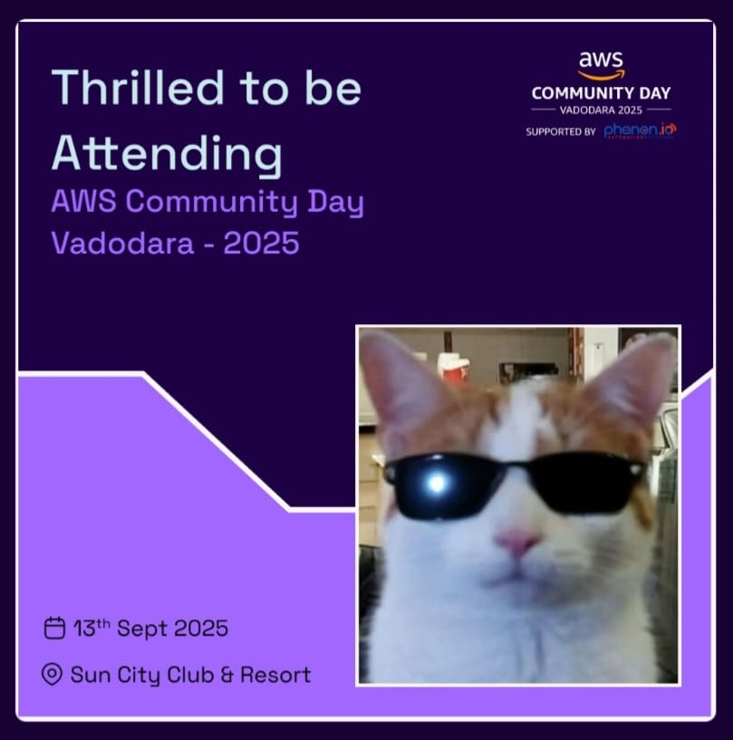

# ACD Photo Cropper

<p align="center">
  
  &nbsp;&nbsp;&nbsp;
  
</p>

<p align="center">
  Create your own ACD (AWS Community Day) badge by uploading and cropping your photo, then download it instantly.
</p>

<p align="center">
  🔗 <a href="https://acd-photo-cropper.vercel.app/" target="_blank">Live Demo</a>
</p>

---

## ✨ Features
- Upload your photo (JPG/PNG supported)  
- Crop, drag, and zoom to fit perfectly  
- Choose from multiple badge templates (Speaker / Attendee)  
- Download the generated badge as PNG  
- Privacy-friendly (everything runs in your browser)  
- Fully responsive across devices  

---

## 🛠️ Tech Stack
- **Framework**: Next.js  
- **Styling**: Tailwind CSS  
- **Image Processing**: HTML5 Canvas  
- **Deployment**: Vercel  

---

## 🚀 Installation & Setup

Clone the repository:

```bash
git clone https://github.com/your-username/ACD-Badge-Maker.git
cd ACD-Badge-Maker
```

Install dependencies:

```bash
npm install
```

Start the development server:

```bash
npm run dev
```
App will be running at:
http://localhost:3000


📖 Usage

1. Open the live app
2. Select a badge template.
3. Upload your photo.
4. Adjust position and scale.
5. Download your badge.


## Sample Generated Badge

Here’s an example created with the tool:



## 📜 License

This project is licensed under the MIT License.

👨‍💻 Author
Nisarg Patel

Portfolio: https://nisargxplores-portfolio.vercel.app/

Twitter: https://x.com/Nisargpatel5563

LinkedIn: https://www.linkedin.com/in/nisarg-patel-7b799a277/